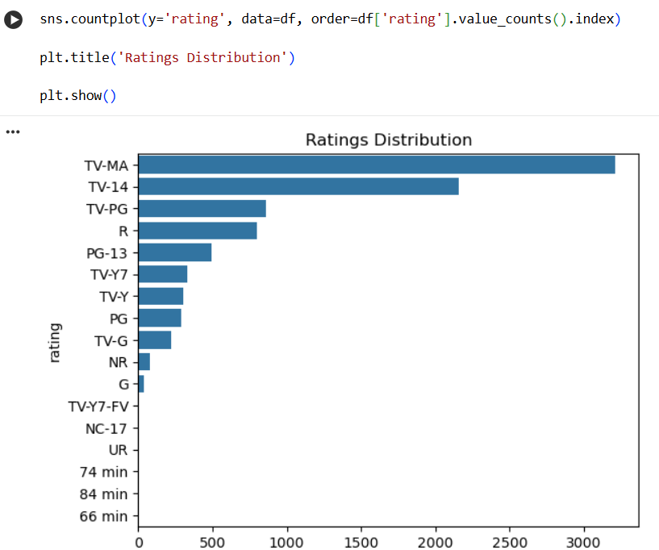

# Netflix Data Science Project 🎬

## Overview
This project analyzes Netflix data using Python and Data Science techniques.

The project includes:
- Data Cleaning
- Data Analysis
- Data Visualization
- Insights Extraction

---

## Technologies Used
- Python
- Pandas
- Matplotlib
- Seaborn
- Jupyter Notebook

---

## Project Tasks

### Data Cleaning
- Handling missing values
- Removing duplicates
- Formatting data

### Data Analysis
- Movies vs TV Shows
- Ratings Analysis
- Release Year Analysis
- Genre Analysis

### Data Visualization
- Charts and Graphs
- Content Distribution
- Trend Analysis

---

## How to Run
1. Download the project
2. Open the notebook file
3. Install required libraries
4. Run all cells

---

## Author
Mahmoud Mostafa
## Screenshots

### Analysis

### Chart 1

### Chart 2

### Chart 3

### Chart 4

### Chart 4

